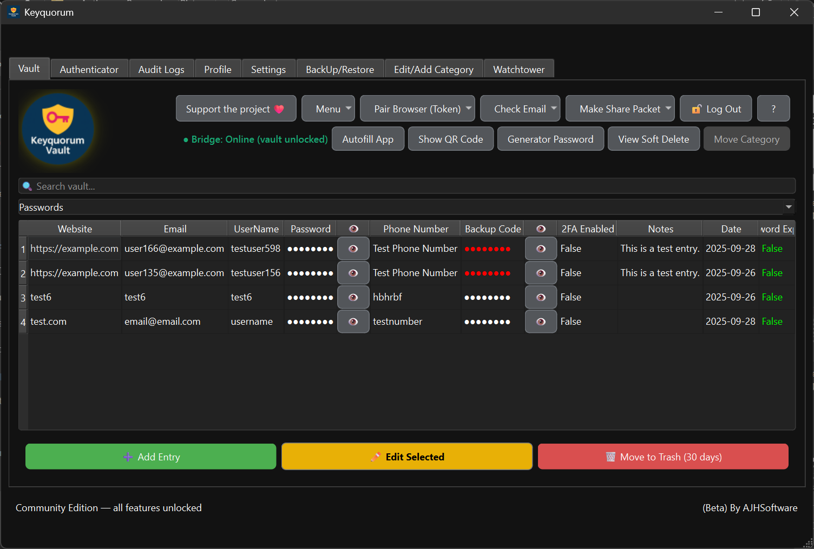
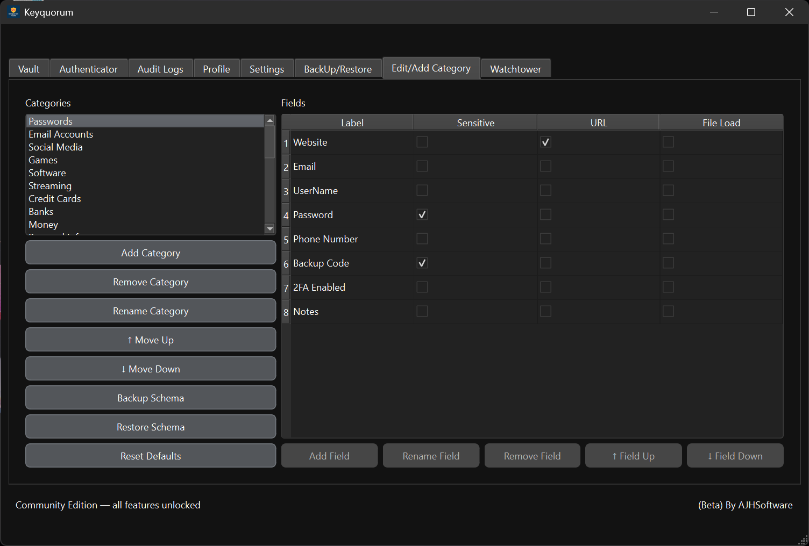
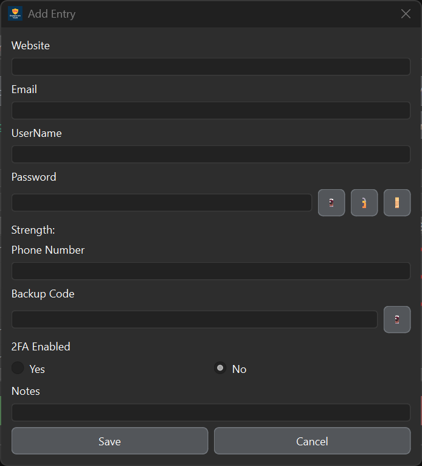
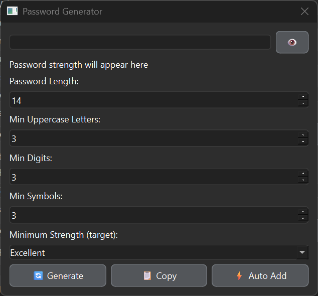

# Keyquorum Vault

**Project Status: On Hold / Rebuild in Progress**

This Python version of Keyquorum Vault is no longer actively maintained.
It is experimental and provided *as is*, to be used at your own risk.

"""
 THERE IS NO WARRANTY FOR THE PROGRAM, TO THE EXTENT PERMITTED BY
APPLICABLE LAW.  EXCEPT WHEN OTHERWISE STATED IN WRITING THE COPYRIGHT
HOLDERS AND/OR OTHER PARTIES PROVIDE THE PROGRAM "AS IS" WITHOUT WARRANTY
OF ANY KIND, EITHER EXPRESSED OR IMPLIED, INCLUDING, BUT NOT LIMITED TO,
THE IMPLIED WARRANTIES OF MERCHANTABILITY AND FITNESS FOR A PARTICULAR
PURPOSE.  THE ENTIRE RISK AS TO THE QUALITY AND PERFORMANCE OF THE PROGRAM
IS WITH YOU.  SHOULD THE PROGRAM PROVE DEFECTIVE, YOU ASSUME THE COST OF
ALL NECESSARY SERVICING, REPAIR OR CORRECTION.
"""

##  License
**
Licensed under:

**GNU General Public License v3.0 or later (GPL-3.0-or-later)**

See `LICENSE`.

Third-party notices:  
`THIRD_PARTY_NOTICES.md`

No guarantees are made regarding security, stability, or data integrity.
This rebuild will take time as I learn a stronger language (Rust) alongside continuing my journey in cybersecurity.

⚠️ If you are using this version:
- Keep secure backups of your vault
- Do not rely on it for critical or production use

---

A full rewrite in **Rust** is planned to improve:
- Security (memory safety, stronger guarantees)
- Performance
- Code quality and maintainability

The initial Rust version will be minimal, focusing only on:
- Login / authentication
- Reading from the vault
- Writing to the vault
- Core encryption/decryption
- YubiKey WRAP support (only)

Many features from the Python version will be removed and rebuilt properly over time.

---

Feedback, ideas, and Rust learning resources are very welcome.

Offline-first password manager by AJH Software  
*(Solo developer project focused on learning and security)*

---

## Overview 

Keyquorum Vault is a **privacy-first, offline password manager** designed with a strict local-only security model.

- No required Online accounts  
- No forced cloud sync  
- No hidden network activity  
- Full local encryption and control  

All sensitive data is handled locally using authenticated encryption (**AES-GCM**) and a strong KDF (**Argon2id**).

---

## 📸 Screenshots

>  Screenshots are from 2025-09-28 and may be slightly outdated.

---

###  Main Interface

---

###  Vault View

---

###  Categories

---

###  Add / Edit Entries

---

###  Password Generator

##  Recent Updates (April 2026)
---

###  Encryption & Rekeying
- Safer migration when:
  - Changing password  
  - Updating vault security  
  - Enabling/disabling YubiKey WRAP  
- Covers:
  - Vault data  
  - Password history  
  - Trash store  
  - Authenticator store  

---

###  YubiKey Support
- Improved WRAP enable/disable flows  
- More reliable rekey handling  

---

##  What this repository contains

- Desktop application (Qt / PySide6 via `qtpy`)  
 
- Vault encryption & storage logic  
- Feature modules:
  - Watchtower  
  - Reminders  
  - Security Center  
  - Sync system  
- Background workers  

##  Security Model

Keyquorum is **offline-first**:

- No automatic cloud sync — users must explicitly enable it and choose their own storage (e.g. NAS or cloud folder)  
- No remote servers  
- No telemetry  
- No hidden background connections  

Network activity only occurs when:
- The user explicitly performs an action  
- The browser extension communicates locally (`127.0.0.1`)
- Password Breach 
All encryption is performed locally.

---

##  Security Direction

All future changes will:
- Be open-source and fully reviewable
- Avoid hidden network activity — no outbound connections unless explicitly triggered by the user  
- Maintain backward compatibility (especially vault data and backups)  
- Prioritise user control and transparency  
- Keep users informed through clear and visible notifications  

---

##  Site
https://ajhsoftware.uk

---

##  Browser Extension

https://github.com/ajhsoftware/Keyquorum-Browser-Extension

Provides autofill via local bridge:
- No cloud communication  
- No credential storage in extension  
- Lock-aware behaviour  

---

##  AI-assisted development

This project is built on 2+ years of hands-on learning and research prior to using AI.

Over the last year, AI has become a regular part of my workflow. I use it as a tool to support development, not replace understanding.

AI has been used for:
- Brainstorming and design ideas  
- Debugging and troubleshooting  
- Improving spelling and grammar  
- Exploring alternative approaches and trade-offs  
- Refactoring and improving code structure  
- Enhancing wording, clarity, and documentation  
- Assisting with code review and identifying potential issues  

I use multiple AI tools (e.g. ChatGPT, Claude, Gemini) to compare outputs and avoid relying on a single source. This allows me to evaluate different approaches and choose what I believe is the best solution.

---

##  Author

Developed by **AJH Software**
